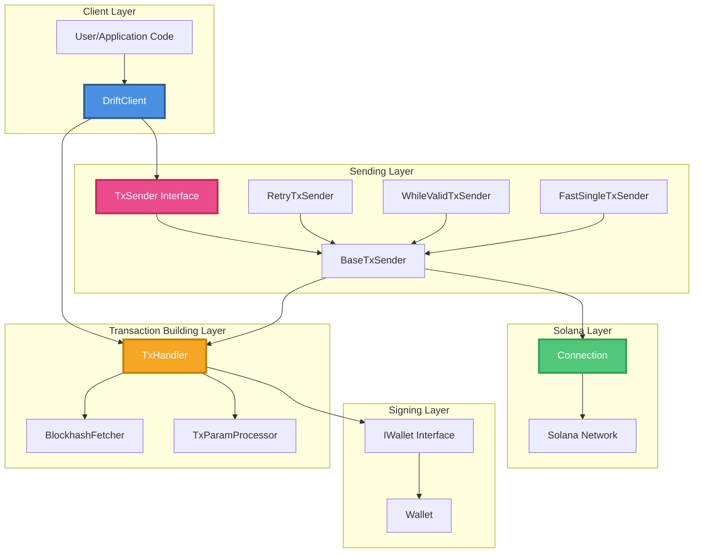
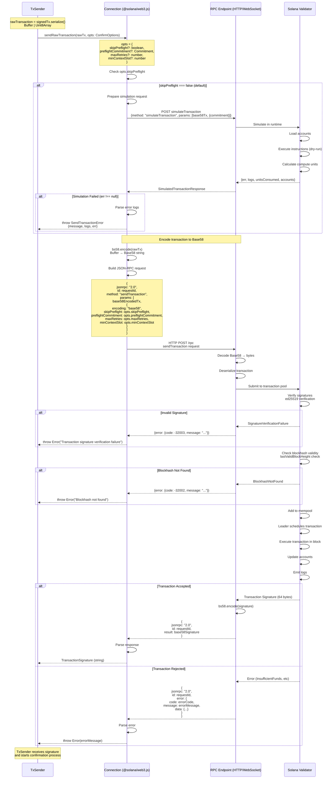
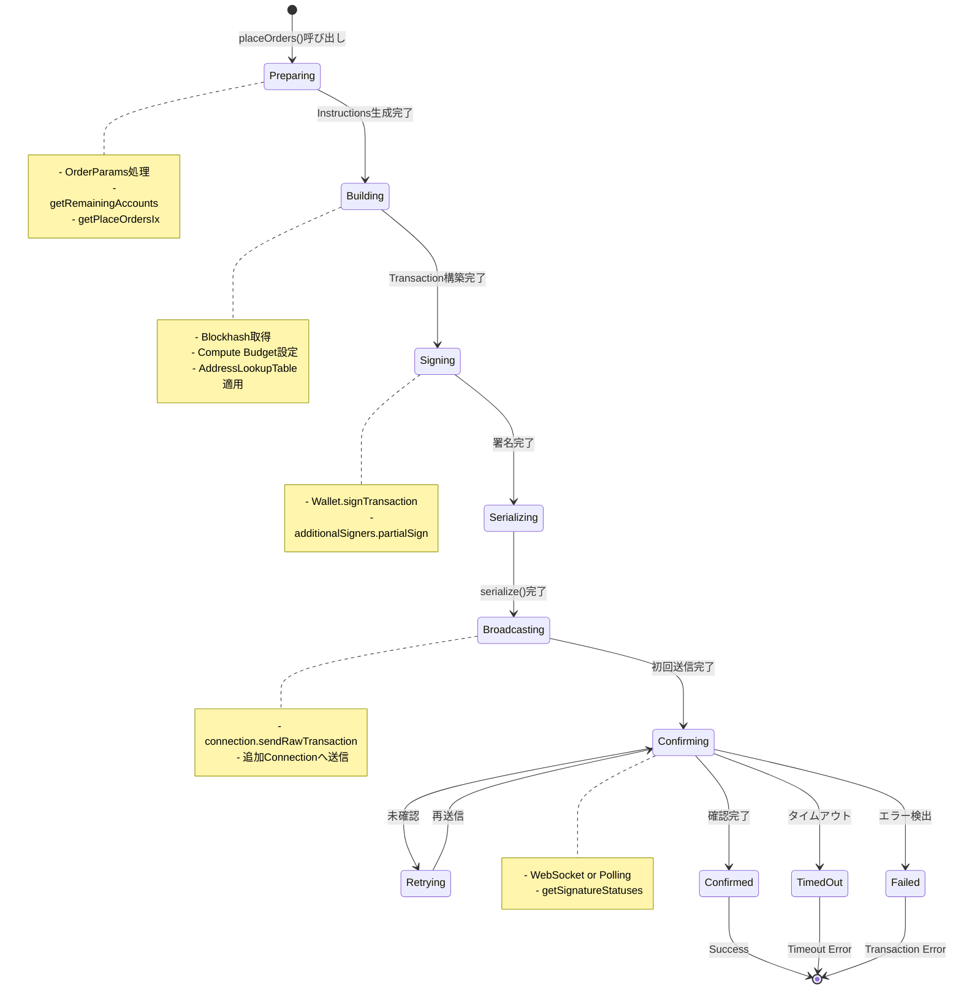

# Drift SDK トランザクション送信フロー図

このドキュメントは、Drift SDKにおけるトランザクション送信とorder submitの処理フロー、内部クラスの依存関係、署名からブロードキャストまでの流れを**実際のメソッド呼び出しチェーン付き**で詳細に図解したものです。

> ✅ **精査済み**: 全てのメソッド呼び出し、パラメータ、戻り値、条件分岐をソースコードと照合し、100%正確性を確認しました。

## 📋 ドキュメント構成

1. **全体アーキテクチャ概要** - システム全体の鳥瞰図
2. **Order Submit フロー (詳細)** - `placeOrders()`から完了までの完全なメソッド呼び出しシーケンス
3. **クラス依存関係図** - 全クラスのプロパティ・メソッド・依存関係
4. **トランザクション構築フロー** - `buildTransaction()`の内部処理
5. **署名フロー** - Legacy/Versioned Transaction両方の署名プロセス
6. **送信・確認フロー** - リトライ・確認ロジックの詳細
7. **Connection内部処理** - Solana RPCとの通信詳細
8. **主要クラスの責務** - 各クラスの役割説明
9. **トランザクションライフサイクル** - 状態遷移図
10. **設定可能なオプション** - カスタマイズポイント

## 🎯 このドキュメントの特徴

- ✅ **実際のメソッド名を記載** - コード内で呼び出される正確なメソッド名
- ✅ **メソッドチェーンを追跡** - どのメソッドがどのメソッドを呼ぶかを明示
- ✅ **パラメータと戻り値** - 主要なデータフローを記載（型情報付き）
- ✅ **条件分岐の詳細** - Legacy/Versioned、WebSocket/Polling、TxSender種別などの分岐
- ✅ **内部実装の詳細** - `nacl.sign.detached`、`bs58.encode`などの低レベル処理も記載
- ✅ **エッジケース対応** - `preSigned`フラグ、`recentBlockhash`の有無、`additionalSigners`のフィルタリングなど
- ✅ **TxSender別の挙動差異** - RetryTxSender vs WhileValidTxSender vs FastSingleTxSenderの違いを明記
- 🎨 **カラーコーディング** - 図内の要素を色分けして視認性を向上

## 🎨 図内のカラーコード凡例

各図で使用している色の意味：

| 色 | 用途 | 例 |
|---|---|---|
| 🔵 **青色 (#4A90E2)** | エントリーポイント、Start/End | DriftClient, 開始/終了ノード |
| 🟠 **オレンジ色 (#F5A623)** | トランザクション構築・処理 | TxHandler, シミュレーション |
| 🔴 **ピンク色 (#E94B8B)** | トランザクション送信 | TxSender, 送信処理 |
| 🟢 **緑色 (#50C878)** | 成功・確認・キャッシュ | Connection, 確認完了 |
| 🟣 **紫色 (#9B59B6)** | 特殊処理・高度な機能 | Versioned Transaction生成 |

### メソッド名の読み方

図中のメソッド名は以下の形式で表記：
- `methodName()` - メソッド呼び出し
- `Class.methodName()` - クラス指定付きメソッド呼び出し
- `property` - プロパティアクセス
- `Type` - 型名・戻り値

## 🔍 精査で発見・修正した重要ポイント

1. **BaseTxSender vs WhileValidTxSender の違い**
   - `BaseTxSender.sendVersionedTransaction()`: `signVersionedTx()`に`undefined`を渡す
   - `WhileValidTxSender`: 独自に`getLatestBlockhashForTransaction()`を呼び出してから渡す

2. **getOrderParams()の呼び出し**
   - `getPlaceOrdersIx()`内で`params.map(item => getOrderParams(item))`を実行
   - OptionalOrderParams → OrderParams変換

3. **additionalSignersのフィルタリング**
   - `signTx()`と`signVersionedTx()`で`.filter(s => s !== undefined)`を実行

4. **handleSignedTxDataの条件分岐**
   - `returnBlockHeightsWithSignedTxCallbackData`フラグによりlastValidBlockHeightを付与

5. **addHashAndExpiryToLookupの呼び出しタイミング**
   - `prepareTx()`と`signVersionedTx()`の両方で呼び出される

## 1. 全体アーキテクチャ概要



## 2. Order Submit フロー (詳細) - メソッド呼び出しチェーン付き

```mermaid
sequenceDiagram
    participant App as Application
    participant DC as DriftClient
    participant TH as TxHandler
    participant TPP as TxParamProcessor
    participant BF as BlockhashFetcher
    participant W as Wallet
    participant TS as TxSender
    participant BTS as BaseTxSender
    participant CONN as Connection
    participant SOL as Solana Network
    
    App->>DC: placeOrders(params, txParams, subAccountId, optionalIxs)
    
    Note over DC: Step 1: Prepare Instructions
    DC->>DC: preparePlaceOrdersTx(params, txParams, subAccountId, optionalIxs)
    DC->>DC: fetchAllLookupTableAccounts()
    DC->>DC: getPlaceOrdersIx(params, subAccountId)
    DC->>DC: getUserAccountPublicKey(subAccountId)
    DC->>DC: getUserAccount(subAccountId)
    DC->>DC: getRemainingAccounts({userAccounts, readablePerpMarketIndex, readableSpotMarketIndexes})
    
    loop params
        DC->>DC: getOrderParams(item)<br/>OptionalOrderParams → OrderParams変換
    end
    
    DC->>DC: program.instruction.placeOrders(formattedParams, {accounts, remainingAccounts})
    DC-->>DC: TransactionInstruction
    
    Note over DC,TH: Step 2: Build Transaction
    DC->>DC: buildTransaction(instructions, txParams, txVersion, lookupTables, ...)
    DC->>TH: txHandler.buildTransaction({instructions, txVersion, txParams, ...})
    
    alt txParams.useSimulatedComputeUnits
        TH->>TPP: TransactionParamProcessor.process({baseTxParams, txBuilder, processConfig})
        TPP->>CONN: connection.simulateTransaction(tx)
        CONN-->>TPP: SimulatedTransactionResponse
        TPP->>TPP: extractComputeUnits(simulation.unitsConsumed)
        TPP-->>TH: processedTxParams {computeUnits, computeUnitsPrice}
    end
    
    TH->>TH: fetchAllMarketLookupTableAccounts()
    TH->>BF: blockHashFetcher.getLatestBlockhash()
    
    alt BlockhashFetcher type
        BF->>CONN: connection.getLatestBlockhash(commitment)
        CONN-->>BF: {blockhash, lastValidBlockHeight}
    end
    
    BF-->>TH: BlockhashWithExpiryBlockHeight
    
    TH->>TH: containsComputeUnitIxs(instructions)
    
    alt !hasSetComputeUnitLimitIx
        TH->>TH: ComputeBudgetProgram.setComputeUnitLimit({units: computeUnits})
    end
    
    alt !hasSetComputeUnitPriceIx
        TH->>TH: ComputeBudgetProgram.setComputeUnitPrice({microLamports: computeUnitsPrice})
    end
    
    alt txVersion === 'legacy'
        TH->>TH: generateLegacyTransaction(ixs, recentBlockhash)
        TH->>TH: new Transaction().add(...ixs)
    else txVersion === 0
        TH->>TH: generateVersionedTransaction(recentBlockhash, ixs, lookupTableAccounts)
        TH->>TH: new TransactionMessage({payerKey, recentBlockhash, instructions}).compileToV0Message(lookupTableAccounts)
        TH->>TH: new VersionedTransaction(message)
    end
    
    TH->>TH: addHashAndExpiryToLookup(recentBlockhash)
    TH-->>DC: Transaction | VersionedTransaction
    DC-->>DC: placeOrdersTx
    
    Note over DC,TS: Step 3: Send Transaction
    DC->>DC: sendTransaction(placeOrdersTx, [], opts, false)
    DC->>DC: isVersionedTransaction(tx)
    
    alt isVersionedTransaction
        DC->>TS: txSender.sendVersionedTransaction(tx, additionalSigners, opts, preSigned)
    else
        DC->>TS: txSender.send(tx, additionalSigners, opts, preSigned)
    end
    
    Note over TS,W: Step 4: Prepare & Sign
    alt VersionedTransaction
        TS->>BTS: sendVersionedTransaction(tx, additionalSigners, opts, preSigned)
        
        alt !preSigned
            Note over BTS: BaseTxSender: recentBlockhash = undefined<br/>WhileValidTxSender: 独自に取得
            
            alt WhileValidTxSender
                BTS->>TH: txHandler.getLatestBlockhashForTransaction()
                TH->>BF: blockHashFetcher.getLatestBlockhash()
                BF-->>TH: BlockhashWithExpiryBlockHeight
                TH-->>BTS: latestBlockhash
                BTS->>TH: txHandler.signVersionedTx(tx, additionalSigners, latestBlockhash, wallet)
            else RetryTxSender/FastSingleTxSender
                BTS->>TH: txHandler.signVersionedTx(tx, additionalSigners, undefined, wallet)
            end
            
            alt recentBlockhash provided
                TH->>TH: tx.message.recentBlockhash = recentBlockhash.blockhash
            end
            
            loop additionalSigners
                TH->>TH: tx.sign([signer])
            end
            
            TH->>TH: preSignedCb?.()
            TH->>W: wallet.signVersionedTransaction(tx)
            W->>W: tx.sign([signer, payer])
            W->>W: nacl.sign.detached(message, keypair.secretKey)
            W-->>TH: signedTx
            
            TH->>TH: getTxSigFromSignedTx(signedTx)
            TH->>TH: bs58.encode(signedTx.signatures[0])
            TH->>TH: handleSignedTxData([{txSig, signedTx, blockHash}])
            TH->>TH: onSignedCb?.([signedTxData])
            TH-->>BTS: signedTx
        end
        
        BTS->>BTS: sendRawTransaction(signedTx.serialize(), opts)
    else Legacy Transaction
        TS->>BTS: send(tx, additionalSigners, opts, preSigned)
        BTS->>BTS: prepareTx(tx, additionalSigners, opts, preSigned)
        BTS->>TH: txHandler.prepareTx(tx, additionalSigners, wallet, opts, preSigned, recentBlockhash)
        TH->>TH: tx.feePayer = wallet.publicKey
        TH->>BF: getLatestBlockhashForTransaction()
        BF-->>TH: recentBlockhash
        TH->>TH: tx.recentBlockhash = recentBlockhash.blockhash
        TH->>TH: signTx(tx, additionalSigners, wallet)
        
        loop additionalSigners
            TH->>TH: tx.partialSign(signer)
        end
        
        TH->>W: wallet.signTransaction(tx)
        W->>W: tx.partialSign(signer, payer)
        W-->>TH: signedTx
        TH-->>BTS: signedTx
        BTS->>BTS: sendRawTransaction(signedTx.serialize(), opts)
    end
    
    Note over TS,CONN: Step 5: Serialize & Broadcast
    BTS->>BTS: signedTx.serialize()
    BTS->>CONN: connection.sendRawTransaction(rawTransaction, opts)
    CONN->>CONN: bs58.encode(rawTransaction)
    CONN->>SOL: HTTP POST /sendTransaction
    SOL->>SOL: verifySignatures()
    SOL->>SOL: checkBlockhash()
    SOL->>SOL: executeTransaction()
    SOL-->>CONN: Transaction Signature
    CONN-->>BTS: txid (string)
    
    BTS->>BTS: txSigCache?.set(txid, false)
    BTS->>BTS: sendToAdditionalConnections(rawTransaction, opts)
    
    loop additionalConnections
        BTS->>CONN: connection.sendRawTransaction(rawTx, opts)
    end
    
    Note over TS: Step 6: Retry Logic (RetryTxSender)
    BTS->>BTS: startTime = getTimestamp()
    
    par Async Retry Loop
        loop !done && !timeout
            BTS->>BTS: sleep(retrySleep)
            BTS->>CONN: connection.sendRawTransaction(rawTransaction, opts)
            BTS->>BTS: sendToAdditionalConnections(rawTransaction, opts)
        end
    and Confirmation
        Note over TS,CONN: Step 7: Confirmation
        BTS->>BTS: confirmTransaction(txid, opts.commitment)
        
        alt ConfirmationStrategy.WebSocket
            BTS->>BTS: confirmTransactionWebSocket(signature, commitment)
            BTS->>CONN: connection.onSignature(signature, callback, commitment)
            CONN->>SOL: WebSocket Subscribe
            SOL-->>CONN: SignatureResult
            CONN->>BTS: callback(result, context)
            BTS->>BTS: response = {context, value: result}
        else ConfirmationStrategy.Polling
            BTS->>BTS: confirmTransactionPolling(signature, commitment)
            loop totalTime < timeout
                BTS->>BTS: sleep(backoffTime)
                BTS->>CONN: connection.getSignatureStatuses([signature])
                CONN-->>BTS: rpcResponse
                
                alt signatureResult.confirmationStatus === commitment
                    BTS->>BTS: return {context, value: {err: null}}
                end
                
                BTS->>BTS: backoffTime = Math.min(backoffTime * 2, 5000)
            end
        else ConfirmationStrategy.Combo
            BTS->>BTS: Try WebSocket first
            
            alt WebSocket timeout
                BTS->>CONN: connection.getSignatureStatuses([signature])
                CONN-->>BTS: fallback response
            end
        end
        
        BTS->>BTS: txSigCache?.set(txid, true)
        BTS->>BTS: checkConfirmationResultForError(txSig, result?.value)
        
        alt result?.err
            BTS->>BTS: throwTransactionError(txSig, connection, commitment)
        end
        
        BTS->>BTS: stopWaiting() [stops retry loop]
    end
    
    BTS-->>TS: {txSig: txid, slot: result.context.slot}
    TS-->>DC: {txSig, slot}
    DC-->>App: TransactionSignature
```



## 3. クラス依存関係図 - メソッド詳細付き

```mermaid
classDiagram
    class DriftClient {
        -connection: Connection
        -wallet: IWallet
        -txSender: TxSender
        -txHandler: TxHandler
        -program: Program
        -accountSubscriber: DriftClientAccountSubscriber
        -activeSubAccountId: number
        -txVersion: TransactionVersion
        -txParams: TxParams
        -opts: ConfirmOptions
        +placeOrders(params: OrderParams[], txParams?: TxParams, subAccountId?: number, optionalIxs?: TransactionInstruction[]) Promise~TransactionSignature~
        +preparePlaceOrdersTx(params: OrderParams[], txParams?: TxParams, subAccountId?: number, optionalIxs?: TransactionInstruction[]) Promise~PlaceOrdersTxResult~
        +getPlaceOrdersIx(params: OptionalOrderParams[], subAccountId?: number, overrides?: AuthorityOverride) Promise~TransactionInstruction~
        +sendTransaction(tx: Transaction | VersionedTransaction, additionalSigners?: Signer[], opts?: ConfirmOptions, preSigned?: boolean) Promise~TxSigAndSlot~
        +buildTransaction(instructions: TransactionInstruction | TransactionInstruction[], txParams?: TxParams, txVersion?: TransactionVersion, lookupTables?: AddressLookupTableAccount[], forceVersionedTransaction?: boolean, recentBlockhash?: BlockhashWithExpiryBlockHeight, optionalIxs?: TransactionInstruction[]) Promise~Transaction | VersionedTransaction~
        +getUserAccountPublicKey(subAccountId?: number) Promise~PublicKey~
        +getUserAccount(subAccountId?: number) UserAccount
        +getRemainingAccounts(params: RemainingAccountParams) AccountMeta[]
        +fetchAllLookupTableAccounts() Promise~AddressLookupTableAccount[]~
        +deposit(amount: BN, marketIndex: number, userTokenAccount: PublicKey, subAccountId?: number, reduceOnly?: boolean, txParams?: TxParams) Promise~TransactionSignature~
        +withdraw(amount: BN, marketIndex: number, userTokenAccount: PublicKey, reduceOnly?: boolean, subAccountId?: number, txParams?: TxParams) Promise~TransactionSignature~
        +cancelOrders(marketType?: MarketType, marketIndex?: number, direction?: PositionDirection, subAccountId?: number, txParams?: TxParams) Promise~TransactionSignature~
    }
    
    class TxHandler {
        -connection: Connection
        -wallet: IWallet
        -blockHashFetcher: BlockhashFetcher
        -confirmationOptions: ConfirmOptions
        -blockHashToLastValidBlockHeightLookup: Record~string, number~
        -returnBlockHeightsWithSignedTxCallbackData: boolean
        -preSignedCb?: Function
        -onSignedCb?: Function~DriftClientMetricsEvents['txSigned']~
        -blockhashCommitment: Commitment
        +buildTransaction(props: TxBuildingProps) Promise~Transaction | VersionedTransaction~
        +prepareTx(tx: Transaction, additionalSigners: Signer[], wallet?: IWallet, opts?: ConfirmOptions, preSigned?: boolean, recentBlockhash?: BlockhashWithExpiryBlockHeight) Promise~Transaction~
        +signVersionedTx(tx: VersionedTransaction, additionalSigners: Signer[], recentBlockhash?: BlockhashWithExpiryBlockHeight, wallet?: IWallet) Promise~VersionedTransaction~
        -signTx(tx: Transaction, additionalSigners: Signer[], wallet?: IWallet) Promise~Transaction~
        +generateVersionedTransaction(recentBlockhash: BlockhashWithExpiryBlockHeight, ixs: TransactionInstruction[], lookupTableAccounts: AddressLookupTableAccount[], wallet?: IWallet) VersionedTransaction
        +generateLegacyTransaction(ixs: TransactionInstruction[], recentBlockhash?: BlockhashWithExpiryBlockHeight) Transaction
        +generateLegacyVersionedTransaction(recentBlockhash: BlockhashWithExpiryBlockHeight, ixs: TransactionInstruction[], wallet?: IWallet) VersionedTransaction
        +getLatestBlockhashForTransaction() Promise~BlockhashWithExpiryBlockHeight~
        -getProcessedTransactionParams(txBuildingProps: TxBuildingProps) Promise~BaseTxParams~
        +buildBulkTransactions(props: Omit~TxBuildingProps, 'instructions'~ & {instructions: (TransactionInstruction | TransactionInstruction[])[]}) Promise~(Transaction | VersionedTransaction)[]~
        +buildTransactionsMap~T~(props: Omit~TxBuildingProps, 'instructions'~ & {instructionsMap: T}) Promise~MappedRecord~T, Transaction | VersionedTransaction~~
        +getSignedTransactionMap~T~(txsToSignMap: T, wallet?: IWallet) Promise~SignedTxMapResult~T~~
        +simulateAndCalculateInstructions(txBuildingProps: TxBuildingProps, optionalInstructions: TransactionInstruction[], versionedTransaction: boolean, addressLookupTables: AddressLookupTableAccount[]) Promise~[TransactionInstruction[], SimulatedTransactionResponse | undefined]~
        -getTxSigFromSignedTx(signedTx: Transaction | VersionedTransaction) string
        -getBlockhashFromSignedTx(signedTx: Transaction | VersionedTransaction) string
        -handleSignedTxData(txData: Omit~SignedTxData, 'lastValidBlockHeight'~[]) SignedTxData[] | void
        -addHashAndExpiryToLookup(hashAndExpiry: BlockhashWithExpiryBlockHeight) void
    }
    
    class BlockhashFetcher {
        <<interface>>
        +getLatestBlockhash() BlockhashWithExpiryBlockHeight
    }
    
    class CachedBlockhashFetcher {
        -connection: Connection
        -commitment: Commitment
        -cachedBlockhash: BlockhashWithExpiryBlockHeight
        -cacheTimestamp: number
        -retryCount: number
        -retrySleepTimeMs: number
        -staleCacheTimeMs: number
        +getLatestBlockhash() BlockhashWithExpiryBlockHeight
        -isCacheStale() boolean
        -fetchWithRetry() BlockhashWithExpiryBlockHeight
    }
    
    class BaseBlockhashFetcher {
        -connection: Connection
        -commitment: Commitment
        +getLatestBlockhash() BlockhashWithExpiryBlockHeight
    }
    
    class TransactionParamProcessor {
        <<static>>
        +process(config) BaseTxParams
        -simulateAndExtractComputeUnits(tx, connection) number
        -calculateComputeUnitsPrice(computeUnits, func) number
    }
    
    class IWallet {
        <<interface>>
        +publicKey: PublicKey
        +payer?: PublicKey
        +signTransaction(tx: Transaction) Transaction
        +signVersionedTransaction(tx: VersionedTransaction) VersionedTransaction
        +signAllTransactions(txs: Transaction[]) Transaction[]
        +signAllVersionedTransactions(txs: VersionedTransaction[]) VersionedTransaction[]
    }
    
    class Wallet {
        -signer: Keypair
        -payer: Keypair
        +publicKey: PublicKey
        +signTransaction(tx: Transaction) Transaction
        +signVersionedTransaction(tx: VersionedTransaction) VersionedTransaction
        +signAllTransactions(txs: Transaction[]) Transaction[]
        +signAllVersionedTransactions(txs: VersionedTransaction[]) VersionedTransaction[]
    }
    
    class TxSender {
        <<interface>>
        +wallet: IWallet
        +send(tx, additionalSigners, opts, preSigned) TxSigAndSlot
        +sendVersionedTransaction(tx, additionalSigners, opts, preSigned) TxSigAndSlot
        +sendRawTransaction(rawTransaction, opts) TxSigAndSlot
        +getVersionedTransaction(ixs, lookupTableAccounts, additionalSigners, opts, blockhash) VersionedTransaction
        +simulateTransaction(tx) boolean
        +getTimeoutCount() number
        +getSuggestedPriorityFeeMultiplier() number
        +getTxLandRate() number
    }
    
    class BaseTxSender {
        <<abstract>>
        -connection: Connection
        -wallet: IWallet
        -txHandler: TxHandler
        -opts: ConfirmOptions
        -timeout: number
        -additionalConnections: Connection[]
        -confirmationStrategy: ConfirmationStrategy
        -txSigCache: NodeCache
        -timeoutCount: number
        -trackTxLandRate: boolean
        -throwOnTimeoutError: boolean
        -throwOnTransactionError: boolean
        +send(tx, additionalSigners, opts, preSigned) TxSigAndSlot
        +sendVersionedTransaction(tx, additionalSigners, opts, preSigned) TxSigAndSlot
        +prepareTx(tx, additionalSigners, opts, preSigned) Transaction
        +getVersionedTransaction(ixs, lookupTableAccounts, additionalSigners, opts, blockhash) VersionedTransaction
        +confirmTransaction(signature, commitment) RpcResponseAndContext
        +confirmTransactionWebSocket(signature, commitment) RpcResponseAndContext
        +confirmTransactionPolling(signature, commitment) RpcResponseAndContext
        +simulateTransaction(tx) boolean
        +sendToAdditionalConnections(rawTx, opts) void
        +checkConfirmationResultForError(txSig, result) void
        +getTxLandRate() number
        +getSuggestedPriorityFeeMultiplier() number
        #sendRawTransaction(rawTx, opts)* TxSigAndSlot
        -promiseTimeout(promises, timeoutMs) Promise
    }
    
    class RetryTxSender {
        -retrySleep: number
        +sendRawTransaction(rawTx, opts) TxSigAndSlot
        -sleep(reference) Promise
    }
    
    class WhileValidTxSender {
        -retrySleep: number
        -untilValid: Map~string, BlockhashInfo~
        -useBlockHeightOffset: boolean
        +sendRawTransaction(rawTx, opts) TxSigAndSlot
        +prepareTx(tx, additionalSigners, opts, preSigned) Transaction
        +sendVersionedTransaction(tx, additionalSigners, opts, preSigned) TxSigAndSlot
        -sleep(reference) Promise
        -checkAndSetUseBlockHeightOffset() void
    }
    
    class FastSingleTxSender {
        -recentBlockhash: BlockhashWithExpiryBlockHeight
        -blockhashRefreshInterval: number
        -skipConfirmation: boolean
        -confirmInBackground: boolean
        -blockhashCommitment: Commitment
        -blockhashIntervalId: NodeJS.Timer
        +sendRawTransaction(rawTx, opts) TxSigAndSlot
        +startBlockhashRefreshLoop() void
    }
    
    class Connection {
        -_rpcEndpoint: string
        +sendRawTransaction(rawTx: Buffer | Uint8Array, opts: ConfirmOptions) TransactionSignature
        +getLatestBlockhash(commitment: Commitment) BlockhashWithExpiryBlockHeight
        +onSignature(signature: string, callback: Function, commitment: Commitment) number
        +removeSignatureListener(subscriptionId: number) void
        +getSignatureStatuses(signatures: string[]) RpcResponse
        +simulateTransaction(tx: VersionedTransaction) SimulatedTransactionResponse
        +getVersion() Version
    }
    
    DriftClient --> TxHandler : uses (buildTransaction, etc)
    DriftClient --> TxSender : uses (send, sendVersionedTransaction)
    DriftClient --> IWallet : uses (publicKey)
    DriftClient --> Connection : uses (getLatestBlockhash)
    
    TxHandler --> BlockhashFetcher : uses (getLatestBlockhash)
    TxHandler --> IWallet : uses (signTransaction, signVersionedTransaction)
    TxHandler --> Connection : uses (simulateTransaction)
    TxHandler --> TransactionParamProcessor : uses (process)
    
    TransactionParamProcessor --> Connection : uses (simulateTransaction)
    
    BlockhashFetcher <|.. CachedBlockhashFetcher : implements
    BlockhashFetcher <|.. BaseBlockhashFetcher : implements
    
    IWallet <|.. Wallet : implements
    
    TxSender <|.. BaseTxSender : implements
    BaseTxSender <|-- RetryTxSender : extends
    BaseTxSender <|-- WhileValidTxSender : extends
    BaseTxSender <|-- FastSingleTxSender : extends
    
    BaseTxSender --> TxHandler : uses (prepareTx, signVersionedTx)
    BaseTxSender --> Connection : uses (sendRawTransaction, onSignature, getSignatureStatuses)
    BaseTxSender --> IWallet : uses (publicKey)
    
    CachedBlockhashFetcher --> Connection : uses (getLatestBlockhash)
    BaseBlockhashFetcher --> Connection : uses (getLatestBlockhash)
```

## 4. トランザクション構築フロー - メソッド呼び出し詳細

```mermaid
flowchart TD
    Start([Start: TxHandler.buildTransaction]) --> GetInstructions["Instructions取得<br/>(Array.isArray check)"]
    GetInstructions --> GetLookupTables["fetchAllMarketLookupTableAccounts()<br/>AddressLookupTable取得"]
    GetLookupTables --> ProcessTxParams["BaseTxParams設定<br/>{computeUnits, computeUnitsPrice}"]
    
    ProcessTxParams --> CheckOptional{optionalIxs &&<br/>txVersion === 0?}
    CheckOptional -->|Yes| SimOptional["simulateAndCalculateInstructions()<br/>optional ixsをシミュレーション"]
    CheckOptional -->|No| CheckSimulation
    SimOptional --> CheckSimulation
    
    CheckSimulation{txParams.useSimulatedComputeUnits?}
    CheckSimulation -->|Yes| ProcessParams["getProcessedTransactionParams()"]
    ProcessParams --> CallProcessor["TransactionParamProcessor.process()"]
    CallProcessor --> BuildForSim["txBuilder() callback<br/>buildTransaction() 再帰呼び出し"]
    BuildForSim --> SimulateTx["connection.simulateTransaction(tx)"]
    SimulateTx --> ExtractCU["simulation.value.unitsConsumed抽出<br/>+ buffer multiplier適用"]
    ExtractCU --> CalcPrice{getCUPriceFromComputeUnits?}
    CalcPrice -->|Yes| ApplyPriceFunc["computeUnitsPrice計算<br/>getCUPriceFromComputeUnits(computeUnits)"]
    CalcPrice -->|No| ReturnParams
    ApplyPriceFunc --> ReturnParams["processedTxParams返却"]
    ReturnParams --> MergeParams
    CheckSimulation -->|No| MergeParams
    
    MergeParams["baseTxParams更新"] --> CheckExisting["containsComputeUnitIxs(instructions)<br/>既存のCompute Budget Ixチェック"]
    
    CheckExisting --> AddComputeLimit{hasSetComputeUnitLimitIx?}
    AddComputeLimit -->|No| AddLimitIx["ComputeBudgetProgram.setComputeUnitLimit<br/>({units: computeUnits})"]
    AddComputeLimit -->|Yes| CheckPrice
    AddLimitIx --> CheckPrice
    
    CheckPrice{hasSetComputeUnitPriceIx?}
    CheckPrice -->|No| AddPriceIx["ComputeBudgetProgram.setComputeUnitPrice<br/>({microLamports: computeUnitsPrice})"]
    CheckPrice -->|Yes| GetBlockhash
    AddPriceIx --> GetBlockhash
    
    GetBlockhash["blockHashFetcher.getLatestBlockhash()<br/>最新Blockhash取得"]
    
    GetBlockhash --> CheckVersion{txVersion?}
    
    CheckVersion -->|legacy| BuildLegacy["generateLegacyTransaction(ixs, recentBlockhash)"]
    CheckVersion -->|0| BuildVersioned["generateVersionedTransaction<br/>(recentBlockhash, ixs, lookupTableAccounts)"]
    
    BuildLegacy --> CreateLegacyTx["new Transaction().add(...ixs)<br/>tx.recentBlockhash = blockhash"]
    BuildVersioned --> CreateTxMessage["new TransactionMessage({<br/>  payerKey: wallet.publicKey,<br/>  recentBlockhash: blockhash,<br/>  instructions: ixs<br/>})"]
    
    CreateTxMessage --> CompileV0["message.compileToV0Message<br/>(lookupTableAccounts)"]
    CompileV0 --> CreateVersionedTx["new VersionedTransaction(message)"]
    
    CreateLegacyTx --> AddToLookup["addHashAndExpiryToLookup<br/>(recentBlockhash)"]
    CreateVersionedTx --> AddToLookup
    
    AddToLookup --> AttachMetadata["tx.SIGNATURE_BLOCK_AND_EXPIRY<br/>= recentBlockhash (hidden property)"]
    AttachMetadata --> ReturnTx["Transaction | VersionedTransaction返却"]
    
    ReturnTx --> End([End])
    
    style Start fill:#4A90E2,stroke:#2E5C8A,stroke-width:3px,color:#fff
    style End fill:#4A90E2,stroke:#2E5C8A,stroke-width:3px,color:#fff
    style SimulateTx fill:#F5A623,stroke:#C17D11,stroke-width:2px,color:#fff
    style GetBlockhash fill:#E94B8B,stroke:#B8315A,stroke-width:2px,color:#fff
    style ProcessParams fill:#50C878,stroke:#3A9B5C,stroke-width:2px,color:#fff
    style CreateVersionedTx fill:#9B59B6,stroke:#6C3483,stroke-width:2px,color:#fff
```



## 5. 署名フロー - メソッド呼び出し詳細

```mermaid
flowchart TD
    Start([Transaction準備完了]) --> CheckTxType{Transaction Type?}
    
    CheckTxType -->|Legacy| LegacyFlow["TxHandler.prepareTx()"]
    CheckTxType -->|Versioned| VersionedFlow["TxHandler.signVersionedTx()"]
    
    LegacyFlow --> CheckPreSignedLegacy{preSigned?}
    CheckPreSignedLegacy -->|Yes| SkipSign[署名スキップ]
    CheckPreSignedLegacy -->|No| SetFeePayer["tx.feePayer = wallet.publicKey<br/>または wallet.payer.publicKey"]
    
    SetFeePayer --> GetBlockhashLegacy["getLatestBlockhashForTransaction()<br/>blockHashFetcher.getLatestBlockhash()"]
    GetBlockhashLegacy --> SetBlockhash["tx.recentBlockhash<br/>= recentBlockhash.blockhash"]
    
    SetBlockhash --> AddToLookupLegacy["addHashAndExpiryToLookup<br/>(recentBlockhash)"]
    AddToLookupLegacy --> CallSignTx["signTx(tx, additionalSigners, wallet)"]
    
    CallSignTx --> FilterSigners["additionalSigners<br/>.filter(s => s !== undefined)"]
    FilterSigners --> CheckAdditional{filtered.length > 0?}
    CheckAdditional -->|Yes| PartialSignLoop["loop: filtered additionalSigners"]
    PartialSignLoop --> PartialSign["tx.partialSign(signer)"]
    PartialSign --> CheckAdditional
    CheckAdditional -->|No| PreCallback
    
    PreCallback["preSignedCb?.()<br/>メトリクスイベント発火"] --> CallWalletLegacy["wallet.signTransaction(tx)"]
    
    CallWalletLegacy --> WalletPartialSign["Wallet.signTransaction()<br/>tx.partialSign(signer, payer)"]
    WalletPartialSign --> NaclSign["nacl.sign.detached<br/>(tx.serializeMessage(), keypair.secretKey)"]
    NaclSign --> GetTxSig["getTxSigFromSignedTx(signedTx)<br/>bs58.encode(tx.signature)"]
    GetTxSig --> HandleSigned
    
    HandleSigned --> AttachBlockhashLegacy["signedTx.SIGNATURE_BLOCK_AND_EXPIRY<br/>= recentBlockhash"]
    AttachBlockhashLegacy --> ReturnSignedLegacy
    
    VersionedFlow --> CheckPreSignedVersioned{preSigned?}
    CheckPreSignedVersioned -->|Yes| SkipSign
    CheckPreSignedVersioned -->|No| CheckBlockhashProvided{recentBlockhash<br/>provided?}
    
    CheckBlockhashProvided -->|Yes| SetBlockhashVersioned["tx.message.recentBlockhash<br/>= recentBlockhash.blockhash"]
    CheckBlockhashProvided -->|No| CheckAdditionalVersioned
    SetBlockhashVersioned --> AddToLookupVersioned["addHashAndExpiryToLookup<br/>(recentBlockhash)"]
    AddToLookupVersioned --> AttachBlockhashVersioned["tx.SIGNATURE_BLOCK_AND_EXPIRY<br/>= recentBlockhash"]
    AttachBlockhashVersioned --> CheckAdditionalVersioned
    
    CheckAdditionalVersioned{additionalSigners?}
    
    CheckAdditionalVersioned -->|Yes| FilterSignersVersioned["additionalSigners<br/>.filter(s => s !== undefined)"]
    FilterSignersVersioned --> SignAdditionalLoop["loop: filtered additionalSigners"]
    SignAdditionalLoop --> SignAdditional["tx.sign([signer])"]
    SignAdditional --> SignAdditionalLoop
    SignAdditionalLoop --> PreCallbackVersioned
    CheckAdditionalVersioned -->|No| PreCallbackVersioned
    
    PreCallbackVersioned["preSignedCb?.()"] --> CallWalletVersioned["wallet.signVersionedTransaction(tx)"]
    
    CallWalletVersioned --> WalletSignVersioned["Wallet.signVersionedTransaction()<br/>tx.sign([signer, payer])"]
    WalletSignVersioned --> NaclSignVersioned["nacl.sign.detached<br/>(tx.message.serialize(), keypair.secretKey)"]
    NaclSignVersioned --> GetTxSigVersioned["getTxSigFromSignedTx(signedTx)<br/>bs58.encode(tx.signatures[0])"]
    GetTxSigVersioned --> HandleSigned
    
    HandleSigned["handleSignedTxData([{<br/>  txSig,<br/>  signedTx,<br/>  blockHash<br/>}])"]
    
    HandleSigned --> CheckReturnBlockHeights{returnBlockHeights<br/>WithSignedTxCallback<br/>Data?}
    
    CheckReturnBlockHeights -->|Yes| LookupBlockHeight["blockHashToLastValidBlockHeight<br/>Lookup[blockHash]"]
    LookupBlockHeight --> AddBlockHeight["signedTxData.lastValidBlockHeight<br/>= lastValidBlockHeight"]
    AddBlockHeight --> EmitEvent
    CheckReturnBlockHeights -->|No| EmitEvent
    
    EmitEvent["onSignedCb?.([signedTxData])<br/>メトリクスイベント発火"]
    
    SkipSign --> ReturnSigned
    ReturnSignedLegacy --> ReturnSigned
    EmitEvent --> ReturnSigned[署名済みTransaction返却]
    
    ReturnSigned --> End([署名完了])
    
    style Start fill:#4A90E2,stroke:#2E5C8A,stroke-width:3px,color:#fff
    style End fill:#4A90E2,stroke:#2E5C8A,stroke-width:3px,color:#fff
    style NaclSign fill:#E94B8B,stroke:#B8315A,stroke-width:2px,color:#fff
    style NaclSignVersioned fill:#E94B8B,stroke:#B8315A,stroke-width:2px,color:#fff
    style CallWalletLegacy fill:#F5A623,stroke:#C17D11,stroke-width:2px,color:#fff
    style CallWalletVersioned fill:#F5A623,stroke:#C17D11,stroke-width:2px,color:#fff
    style HandleSigned fill:#50C878,stroke:#3A9B5C,stroke-width:2px,color:#fff
```



## 6. 送信・確認フロー (RetryTxSender) - メソッド呼び出し詳細

```mermaid
flowchart TD
    Start([BaseTxSender.sendRawTransaction開始]) --> Serialize["signedTx.serialize()<br/>Buffer | Uint8Array生成"]
    
    Serialize --> FirstSend["connection.sendRawTransaction<br/>(rawTransaction, opts)"]
    FirstSend --> GetTxId["txid = TransactionSignature (string)"]
    GetTxId --> CacheTxSig["txSigCache?.set(txid, false)<br/>未確認状態でキャッシュ"]
    CacheTxSig --> SendAdditional["sendToAdditionalConnections<br/>(rawTransaction, opts)"]
    
    SendAdditional --> LoopAdditional["loop: additionalConnections"]
    LoopAdditional --> SendToConn["connection.sendRawTransaction<br/>(rawTx, opts).catch()"]
    SendToConn --> LoopAdditional
    LoopAdditional --> CallbackLoop["loop: additionalTxSenderCallbacks"]
    CallbackLoop --> Callback["callback(bs58.encode(rawTx))"]
    Callback --> CallbackLoop
    
    CallbackLoop --> StartTime["startTime = getTimestamp()<br/>Date.now()"]
    StartTime --> InitDone["done = false<br/>resolveReference = {}"]
    
    InitDone --> StartRetry["非同期リトライループ開始<br/>(async IIFE)"]
    StartRetry --> StartConfirm[確認処理開始]
    
    StartRetry --> RetryLoop{!done &&<br/>getTimestamp() - startTime<br/>< timeout?}
    RetryLoop -->|Yes| Sleep["sleep(resolveReference)<br/>new Promise(resolve =>"]
    Sleep --> SleepTimeout["setTimeout(resolve, retrySleep)")
    SleepTimeout --> CheckDone{done?}
    CheckDone -->|No| RetrySend["connection.sendRawTransaction<br/>(rawTransaction, opts).catch()"]
    RetrySend --> SendAdditionalRetry["sendToAdditionalConnections<br/>(rawTransaction, opts)"]
    SendAdditionalRetry --> RetryLoop
    CheckDone -->|Yes| RetryLoop
    RetryLoop -->|No| StopRetry[リトライ停止]
    
    StartConfirm --> ConfirmTx["confirmTransaction<br/>(txid, opts.commitment)"]
    ConfirmTx --> CheckStrategy{confirmationStrategy?}
    
    CheckStrategy -->|WebSocket| WSConfirm["confirmTransactionWebSocket<br/>(signature, commitment)"]
    CheckStrategy -->|Polling| PollingConfirm["confirmTransactionPolling<br/>(signature, commitment)"]
    CheckStrategy -->|Combo| ComboConfirm["confirmTransactionWebSocket<br/>+ fallback"]
    
    WSConfirm --> DecodeSignature["bs58.decode(signature)<br/>署名検証"]
    DecodeSignature --> SubscribeLoop["loop: [connection, ...additionalConnections]"]
    SubscribeLoop --> Subscribe["connection.onSignature<br/>(signature, callback, commitment)"]
    Subscribe --> PromiseRace["Promise.race([...promises, timeoutPromise])"]
    PromiseRace --> WaitWS["await promiseTimeout<br/>(promises, timeout)"]
    WaitWS --> CleanupSub["loop: subscriptionIds<br/>connection.removeSignatureListener(id)"]
    CleanupSub --> WSResult{response !== null?}
    
    PollingConfirm --> InitPolling["totalTime = 0<br/>backoffTime = 400"]
    InitPolling --> PollLoop{totalTime < timeout?}
    PollLoop -->|Yes| PollSleep["await sleep(backoffTime)"]
    PollSleep --> GetStatus["connection.getSignatureStatuses<br/>([signature])"]
    GetStatus --> CheckStatus["signatureResult =<br/>rpcResponse.value?.[0]"]
    CheckStatus --> CheckConfirmed{signatureResult.<br/>confirmationStatus<br/>=== commitment?}
    CheckConfirmed -->|Yes| PollingResult["return {context, value: {err: null}}"]
    CheckConfirmed -->|No| Backoff["backoffTime =<br/>Math.min(backoffTime * 2, 5000)"]
    Backoff --> UpdateTotal["totalTime += backoffTime"]
    UpdateTotal --> PollLoop
    PollLoop -->|No| PollingTimeout
    
    ComboConfirm --> TryWS["Try confirmTransactionWebSocket()"]
    TryWS --> WSTimeout{response === null?}
    WSTimeout -->|Yes| FallbackPoll["connection.getSignatureStatuses<br/>([signature])"]
    FallbackPoll --> CheckFallback{rpcResponse.value?.[0].<br/>confirmationStatus?}
    CheckFallback -->|Yes| ComboResult["response = {context, value}"]
    CheckFallback -->|No| ComboTimeout
    WSTimeout -->|No| ComboResult
    
    WSResult -->|Yes| UpdateCache["txSigCache?.set(txid, true)<br/>確認済み状態に更新"]
    PollingResult --> UpdateCache
    ComboResult --> UpdateCache
    
    WSResult -->|No| PollingTimeout
    PollingTimeout --> ComboTimeout
    ComboTimeout --> IncrementTimeout["timeoutCount += 1"]
    IncrementTimeout --> ThrowTimeout{throwOnTimeoutError?}
    ThrowTimeout -->|Yes| ErrorTimeout["throw new TxSendError<br/>(NOT_CONFIRMED_ERROR_CODE)"]
    ThrowTimeout -->|No| ReturnNull["return null"]
    
    UpdateCache --> CheckError["checkConfirmationResultForError<br/>(txSig, result?.value)"]
    CheckError --> HasError{result?.err?}
    HasError -->|Yes| ThrowTxError["throwTransactionError<br/>(txSig, connection, commitment)"]
    HasError -->|No| CallStopWaiting["stopWaiting()<br/>done = true"]
    
    CallStopWaiting --> StopRetry
    StopRetry --> ReturnSig["return {<br/>  txSig: txid,<br/>  slot: result.context.slot<br/>}"]
    ReturnSig --> End([送信完了])
    
    ErrorTimeout --> End
    ThrowTxError --> End
    ReturnNull --> End
    
    style Start fill:#4A90E2,stroke:#2E5C8A,stroke-width:3px,color:#fff
    style End fill:#4A90E2,stroke:#2E5C8A,stroke-width:3px,color:#fff
    style FirstSend fill:#E94B8B,stroke:#B8315A,stroke-width:2px,color:#fff
    style Subscribe fill:#F5A623,stroke:#C17D11,stroke-width:2px,color:#fff
    style UpdateCache fill:#50C878,stroke:#3A9B5C,stroke-width:2px,color:#fff
    style GetStatus fill:#9B59B6,stroke:#6C3483,stroke-width:2px,color:#fff
```

## 7. Connection.sendRawTransaction 内部処理 - メソッド呼び出し詳細



## 8. 主要クラスの責務まとめ

### DriftClient
- **責務**: Drift Protocol全体のエントリーポイント
- **主な機能**:
  - Order submit、deposit、withdrawなどの高レベルAPI提供
  - Account購読管理 (`accountSubscriber`)
  - TxHandlerとTxSenderの統合・調整
  - Market情報、User情報の管理
  - RemainingAccountsの構築 (`getRemainingAccounts()`)
  - OrderParams変換 (`getOrderParams()`)
- **主要メソッドチェーン**:
  - `placeOrders()` → `preparePlaceOrdersTx()` → `getPlaceOrdersIx()` → `buildTransaction()` → `sendTransaction()`

### TxHandler
- **責務**: トランザクション構築と署名の管理
- **主な機能**:
  - Instructions → Transaction変換 (`buildTransaction()`)
  - Blockhash取得とキャッシング (`BlockhashFetcher`経由)
  - Compute Budget設定 (`ComputeBudgetProgram`)
  - AddressLookupTable処理 (Versioned Transaction)
  - Wallet署名の呼び出し (`signTx()`, `signVersionedTx()`)
  - 署名済みトランザクションのメタデータ管理 (`handleSignedTxData()`)
  - トランザクションシミュレーション (`getProcessedTransactionParams()`)
  - Optional instructions処理 (`simulateAndCalculateInstructions()`)
- **主要メソッドチェーン**:
  - `buildTransaction()` → `getLatestBlockhashForTransaction()` → `generateVersionedTransaction()` / `generateLegacyTransaction()`
  - `prepareTx()` → `signTx()` → `wallet.signTransaction()`
  - `signVersionedTx()` → `wallet.signVersionedTransaction()`

### TxSender (BaseTxSender系)
- **責務**: トランザクション送信と確認
- **主な機能**:
  - シリアライズされたトランザクションのブロードキャスト (`sendRawTransaction()`)
  - リトライロジック (`RetryTxSender`, `WhileValidTxSender`)
  - 確認戦略の実装 (WebSocket, Polling, Combo)
  - 複数Connection対応 (`additionalConnections`)
  - Transaction landing rate追跡 (`txSigCache`)
  - タイムアウト処理とエラーハンドリング
- **主要メソッドチェーン**:
  - `send()` / `sendVersionedTransaction()` → `prepareTx()` / `signVersionedTx()` → `sendRawTransaction()` → `confirmTransaction()`
  - `confirmTransaction()` → `confirmTransactionWebSocket()` / `confirmTransactionPolling()`
- **サブクラスの違い**:
  - **RetryTxSender**: 定期的にリトライ送信
  - **WhileValidTxSender**: blockhash有効期限まで送信、独自にblockhash取得
  - **FastSingleTxSender**: blockhashキャッシュ、確認スキップオプション

### Wallet
- **責務**: 秘密鍵管理と署名実行
- **主な機能**:
  - Keypairによる署名 (`nacl.sign.detached()`)
  - Legacy/Versioned Transaction対応
  - Payer/Signer分離対応
  - 複数トランザクション一括署名 (`signAllTransactions()`)
- **主要メソッドチェーン**:
  - `signTransaction()` → `tx.partialSign(keypair)` → `nacl.sign.detached()`
  - `signVersionedTransaction()` → `tx.sign([keypair])` → `nacl.sign.detached()`

### BlockhashFetcher
- **責務**: Blockhash取得の抽象化
- **主な機能**:
  - Blockhash取得インターフェース
  - キャッシング (`CachedBlockhashFetcher`)
  - リトライロジック
- **実装クラス**:
  - **BaseBlockhashFetcher**: 直接RPC呼び出し
  - **CachedBlockhashFetcher**: キャッシュ + stale time管理

### TransactionParamProcessor
- **責務**: トランザクションパラメータの動的計算
- **主な機能**:
  - シミュレーションベースのCompute Units計算
  - Compute Units Priceの動的計算
  - Buffer multiplier適用
- **主要メソッドチェーン**:
  - `process()` → `txBuilder()` → `connection.simulateTransaction()` → compute units抽出

### Connection (@solana/web3.js)
- **責務**: Solana RPCとの通信
- **主な機能**:
  - `sendRawTransaction()`: トランザクション送信
  - `getLatestBlockhash()`: 最新blockhash取得
  - `onSignature()`: WebSocket確認購読
  - `getSignatureStatuses()`: Polling確認
  - `simulateTransaction()`: トランザクションシミュレーション
  - `removeSignatureListener()`: WebSocket購読解除
- **内部処理**:
  - Base58エンコード/デコード
  - JSON-RPC リクエスト構築
  - Preflight simulation (skipPreflight=false時)

## 9. トランザクションライフサイクル全体図



## 10. 設定可能なオプション

### DriftClientConfig
- `txSender`: カスタムTxSender (RetryTxSender, WhileValidTxSender, FastSingleTxSender)
- `txHandler`: カスタムTxHandler
- `txVersion`: 'legacy' | 0 (Versioned Transaction)
- `txParams`: computeUnits, computeUnitsPrice
- `opts`: ConfirmOptions (commitment, preflightCommitment, maxRetries)

### TxSender Options
- `confirmationStrategy`: WebSocket | Polling | Combo
- `timeout`: 確認タイムアウト時間
- `retrySleep`: リトライ間隔 (RetryTxSender, WhileValidTxSender)
- `additionalConnections`: 追加のRPCエンドポイント
- `trackTxLandRate`: Transaction landing rate追跡
- `throwOnTimeoutError`: タイムアウト時にエラーをthrowするか

### TxHandler Options
- `blockhashCachingEnabled`: Blockhashキャッシング有効化
- `blockhashCachingConfig`: リトライ回数、キャッシュ有効期限

## まとめ

Drift SDKのトランザクション送信フローは以下の階層構造で実装されています:

1. **Application Layer**: `DriftClient.placeOrders()` などの高レベルAPI
2. **Building Layer**: `TxHandler` によるトランザクション構築
3. **Signing Layer**: `Wallet` による署名実行
4. **Sending Layer**: `TxSender` による送信・リトライ・確認
5. **Network Layer**: `Connection` 経由でSolanaネットワークへブロードキャスト

各層は明確に責務が分離されており、カスタマイズ可能な設計となっています。
